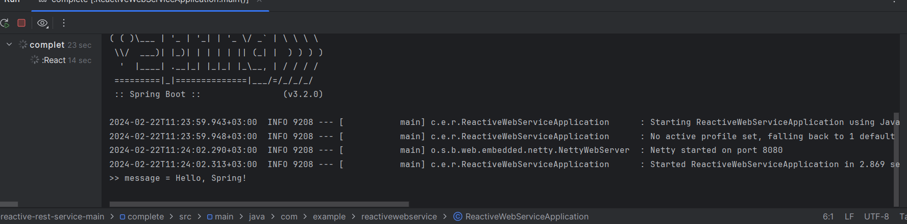

# RESTful WEB Service

Суть: Полноценный Restful веб-сервис, выводящий "Hello, Spring"

Стек: Java, Sprint Boot (Webflux). Построено на Gradle.

В основе программы руководство Spring.io "Building a Reactive Restful Web Service" (ссылка на него представлена ниже)

## Как запустить?

1. Клонируем репозиторий
2. Запускаем spring app в IDE
3. Результат работы выводится в строке компилятора и на локальном сервере, созданном Spring Boot (http://localhost:8080/)

Если результат не выводится, то проверьте права, плагины и версии
 В помощь: https://spring.io/guides/gs/reactive-rest-service#initial

Результат:

